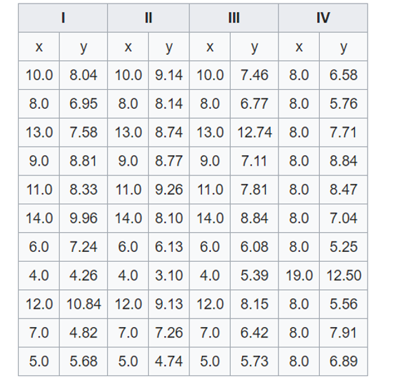
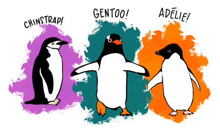

```{r setup, include=FALSE}
library(learnr)
library(ggplot2)
library(palmerpenguins)
library(dplyr)

```

## Introduction

Data visualisation is the visual representation of data in the form of plots, charts, maps and infographics. It is an accessible way to identify patterns and trends in your data, but can also tell you about the quality of your data and how it should be analysed.

Data visualisation is an important part of our every day lives e.g such as on the BBC News (who use R to produce their graphics - see [here](https://bbc.github.io/rcookbook/) on how they do it!)

Today we will learn how to make and customise four types of plots using the R library `ggplot2`:

{width=70%}

## PLOT YOUR DATA!

### The first step of any analysis is to PLOT YOUR DATA!

Why? A good illustration of why this is important is using a dataset called the Anscombe's Quartet:

{width=50%}

Each of these 4 data sets has an almost identical results for linear regression (R2, slope and intercept):

```{r Ex1, exercise = TRUE}
summary(lm(anscombe$y1 ~ anscombe$x1))
```

However, plotting these figures shows a different picture (literally and metaphorically):

```{r echo = F, message = F}
anscombe_plot <- rbind(as.matrix(anscombe)[,c(1, 5)],
                       as.matrix(anscombe)[,c(2, 6)],
                       as.matrix(anscombe)[,c(3, 7)],
                       as.matrix(anscombe)[,c(4, 8)])
anscombe_plot <- data.frame(anscombe_plot)
anscombe_plot$Dataset <- rep(paste("Dataset", 1:4), each = 11)

anscombe_plot <- ggplot(anscombe_plot, aes(x1, y1)) +
  stat_smooth(method = "lm", se = F, fullrange = TRUE, colour = "lightblue") +
  geom_point() +
  facet_wrap(~Dataset) +
  theme_bw() +
  labs(x = "x", y = "y")

anscombe_plot

```


How would you change your data analysis based on the patterns that you visualise?


## Simple graphics in R (base graphics)

One of **R**'s most powerful tools is its ability to produce publication quality graphics in an automated and reproducible way.

Base **R** contains graphical tools for simple, exploratory graphics. These are easily called with functions such as `hist()` and `plot()`:

```{r Ex3test, exercise = T}
library(palmerpenguins)

# histogram
hist(penguins$flipper_length_mm)

# plot
plot(flipper_length_mm ~ bill_length_mm, data = penguins)

# boxplot
boxplot(flipper_length_mm ~ species, data = penguins)
```

You can do many things you require in base graphics, but common actions and customisation are difficult. Base graphics are good for quick data exploration, but for everything else we recommend the graphics library `ggplot2`. If you want to explore customisation of base graphics, you can access my tutorial [here](https://rstudio-pubs-static.s3.amazonaws.com/7953_4e3efd5b9415444ca065b1167862c349.html).


## Anatomy of a Graph

What's wrong with this graph?

```{r echo = F, warning=F}

ggplot(penguins, aes(bill_length_mm, bill_depth_mm, colour = species)) +
  geom_point(size = 8) +
  theme_classic() +
  theme(legend.position = "none",
        axis.text.y = element_text(size = 6),
        panel.background = element_rect(fill = 'grey50')) +
  scale_colour_manual(values = c("grey60", "red", "green")) +
  labs(x = "Bill Length", y = "") +
  scale_x_continuous(breaks = seq(40, 60, 20)) 

```

<details><summary><font color="blue">**Click here for answers**</font></summary>

* Axes - no y label
* Axes - font size too small
* Axes - no units on x label
* Axes - units too spaced out on x
* Points - too large and obscure points behind
* Points - not colourblind friendly
* Points - not easily visible against background
* Figure - no legend
* Figure - no title or label
* Figure - it's ugly

</details>

If we fix these issues, then it can look a bit nicer:

```{r echo = F, message = F, warning=F}

ggplot(penguins, aes(x = bill_length_mm, y = bill_depth_mm, colour = species)) +    # Dataset and aesthetic properties
  geom_point(alpha = 0.8, size = 2) +                                       # Make a scatterplot, modify the transparency and size
  theme_bw() +                                                              # Use the bw theme to remove the grey background
  labs(x = "Bill Length (mm)", y = "Bill Depth (mm)", colour = "Species") + # Label the x, y and colour parameters
  scale_colour_brewer(palette = "Dark2") +                                  # Change the colour scheme
  stat_smooth(method = "lm") +                                              # Add a linear regression line
  scale_x_continuous(breaks = seq(20, 70, 5)) +                       # Change the scale on the x axis to seq(start, stop, interval)
  scale_y_continuous(breaks = seq(10, 30, 2))                         # Change the scale on the y axis to seq(start, stop, interval)

```

We will do this using the R library `ggplot2`.


## `ggplot2` - the grammar of graphics.

`ggplot2` is a plotting system in **R** which aims to take the best parts of base graphics and allow for easy plot customisation. It has extensive documentation and examples [here](https://ggplot2.tidyverse.org/reference/index.html)

The beauty of `ggplot2` is that you can build up the graph in different steps. The main steps can be summarised as follows: 

1.  **Data:** `ggplot()` Data with aesthetic (visual) properties (`aes()`).
2.  **Geom:** `geom_...()` The type of plot (line, point, box-plot, etc.)
3.  **Stat:** `stat_...()` Statistical transformations (regression lines, smoothers, etc)*
4. **Theme**  `theme() and others` How do you want your graph to look?
5. **Other customisations** e.g. facetings, scales, zoom, etc.

* NB. every geom has a default statistic, so this component is not always specified.

In this tutorial, we will do a few worked examples to investigate different aspects of plotting and customisation. We will use the Palmer Penguin data set to explore relationships between various continuous and discrete traits.

Here are the penguins <3



Click the link [here](https://allisonhorst.github.io/palmerpenguins/) for more info.


## Anatomy of a Graph

What's wrong with this graph?

```{r echo = F, warning=F}

ggplot(penguins, aes(bill_length_mm, bill_depth_mm, colour = species)) +
  geom_point(size = 8) +
  theme_classic() +
  theme(legend.position = "none",
        axis.text.y = element_text(size = 6),
        panel.background = element_rect(fill = 'grey50')) +
  scale_colour_manual(values = c("grey60", "red", "green")) +
  labs(x = "Bill Length", y = "") +
  scale_x_continuous(breaks = seq(40, 60, 20)) 

```

<details><summary><font color="blue">**Click here for answers**</font></summary>

* Axes - no y label
* Axes - font size too small
* Axes - no units on x label
* Axes - units too spaced out on x
* Points - too large and obscure points behind
* Points - not colourblind friendly
* Points - not easily visible against background
* Figure - no legend
* Figure - no title or label
* Figure - it's ugly

</details>

If we fix these issues, then it can look a bit nicer:

```{r echo = F, message = F, warning=F}

ggplot(penguins, aes(x = bill_length_mm, y = bill_depth_mm, colour = species)) +    # Dataset and aesthetic properties
  geom_point(alpha = 0.8, size = 2) +                                       # Make a scatterplot, modify the transparency and size
  theme_bw() +                                                              # Use the bw theme to remove the grey background
  labs(x = "Bill Length (mm)", y = "Bill Depth (mm)", colour = "Species") + # Label the x, y and colour parameters
  scale_colour_brewer(palette = "Dark2") +                                  # Change the colour scheme
  stat_smooth(method = "lm") +                                              # Add a linear regression line
  scale_x_continuous(breaks = seq(20, 70, 5)) +                       # Change the scale on the x axis to seq(start, stop, interval)
  scale_y_continuous(breaks = seq(10, 30, 2))                         # Change the scale on the y axis to seq(start, stop, interval)

```

We will do this using the R library `ggplot2`.


## `ggplot2` basics - a histogram with `geom_histogram()`

Load the `ggplot2`, `dplyr` and `palmerpenguins` libraries. 

```{r}

library(ggplot2)
library(dplyr)
library(palmerpenguins)

glimpse(penguins)

```

### Histogram of `flipper_length_mm`

In this exercise, we will learn about `geom_histogram()`, colour/fill, density plots and faceting.

The first step is to specify our `penguins` dataset in `ggplot2()`:

```{r Ex4, exercise = T}
ggplot(penguins)
```

Then specify the aesthetic properties using `aes()`. In a histogram, we only have one variable on the x-axis, so we will specify this as:

```{r Ex5, exercise = T}
ggplot(penguins, aes(x = flipper_length_mm))
```

You can see by running this line alone, we have already run into a problem - there is no data plotted on the graph! This is because ggplot doesn't know what type of graph we want. We need to specify the `geom` i.e. the type of plot. For a histogram, this is `geom_histogram()`. We add this to our first layer with a `+` sign:

```{r Ex6, exercise = T}

ggplot(penguins, aes(x = flipper_length_mm)) +
  geom_histogram()

# Change the bin width to 1 mm
ggplot(penguins, aes(x = flipper_length_mm)) +
  geom_histogram(binwidth = 1)

```

Note that it is common practise to put anything separated by `+` onto a new line. This way, you can build up the graph line by line.

### Customisation

This graph looks good, but not amazing. We can now start to make modifications to improve the look of the graph.

#### Labels

We can add this with `+` and `labs()`. Remember to put text in " "!

```{r Ex7, exercise = T}
ggplot(penguins, aes(x = flipper_length_mm)) +
  geom_histogram() +
  labs(x = "Flipper Length (mm)", y = "Frequency", title = "Histogram of flipper length")
```

#### Basic colour and fill.

We can specify the outline and fill colours for each bar within the geom that makes that visualisation.

```{r Ex8, exercise = T}
ggplot(penguins, aes(x = flipper_length_mm)) +
  geom_histogram(colour = "blue", fill = "lightblue")
```

A list of all colours in R can be called using the command `colours()` or can be specified using HEX codes: see [example](https://www.w3schools.com/colors/colors_picker.asp).

#### Colour by a categorical variable.

A common action in R is to colour variables by a categorical or quantitative aspect of the data, in this case, `species`. Let's start afresh:

```{r Ex9, exercise = T}
ggplot(penguins, aes(x = flipper_length_mm)) +
  geom_histogram()
```

In this case, because species is defined in the dataset `penguins`, it is an aesthetic property of the data. Therefore, it has to be specified in `aes()`. We can add this using `fill =` in the first line:

```{r Ex10, exercise = T}
ggplot(penguins, aes(x = flipper_length_mm, fill = species)) +
  geom_histogram(colour = "black")
```

This looks bad for several reasons! We don't know if they overlap, we can't compare the species easily, etc.

There are two solutions here:

#### Make density plots instead

```{r Ex11, exercise = T}
ggplot(penguins, aes(x = flipper_length_mm, fill = species)) +
  geom_density()

#~~ Make the distributions more transparent with alpha

ggplot(penguins, aes(x = flipper_length_mm, fill = species)) +
  geom_density(alpha = 0.5)

```

... or...

#### Faceting

One nice feature of `ggplot2` is that you can facet your data based on a categorical variable. Let's go back to a simple graph again, and add the line `facet_wrap()` specifying `species`:

```{r Ex12, exercise = T}
ggplot(penguins, aes(x = flipper_length_mm)) +
  geom_histogram() +
  facet_wrap(~species)

# Make the number of columns = 1 for easier comparison.

ggplot(penguins, aes(x = flipper_length_mm)) +
  geom_histogram() +
  facet_wrap(~species, ncol = 1)

```

### The finished graph

We can then combine the modifications we made above to make the full graph:

```{r}

# penguins dataset, with x of flipper length and fill by species +
# make a histogram with a bar for every 1mm and colour the edges black +
# label the x axis and give the plot a title +
# create facets based on species, and make them all appear in one column

ggplot(penguins, aes(x = flipper_length_mm, fill = species)) +
  geom_histogram(binwidth = 1, colour = "black") +
  labs(x = "Flipper Length (mm)", title = "Histogram of flipper length in Palmer penguins.") +
  facet_wrap(~species, ncol = 1)

```

### Exercise 1.

You should now be able to create the following two graphs, based on what you have learned above, or via the information provided in the question. Some clickable hints are provided below.

**1. Create a histogram of bill depth by building up the following layers:**

(a) Fill the bars by species.

(b) Facet the graph by sex and species (more information on faceting is [here](https://ggplot2.tidyverse.org/reference/index.html#facetting).

(c) Change the labels to be more appropriate. 

It should look like this: 

```{r echo = F, message = F, warning=F}

ggplot(penguins, aes(x = bill_depth_mm, fill = species)) +
  geom_histogram(colour = "black") +
  labs(x = "Bill Depth (mm)", fill = "Penguin species") +
  facet_grid(species ~ sex)

```

<details><summary>**Hint: legend label:** [click]</summary>

Specify `fill =` in `labs()`

</details>

<details><summary>**Hint: faceting:** [click]</summary>

Use `facet_grid()` with species and sex. 

</details>


**2. Create a density plot of bill depth.**

(a) Fill and colour by sex.
(b) Facet by species.
(c) Change the labels to be more appropriate.
(d) Remove the NA values if you can.

It should look like this: 

```{r echo = F}

penguins_subset <- subset(penguins, !is.na(sex))

ggplot(penguins_subset, aes(x = bill_depth_mm, fill = sex, colour = sex)) +
  geom_density(alpha = 0.6) +
  labs(x = "Bill Depth (mm)", fill = "Sex", colour = "Sex") +
  facet_wrap(~species)

```

<details><summary>**Hint: remove NAs:** [click]</summary>

Subset the data to remove the NA values e.g. `penguins_subset <- subset(penguins, !is.na(sex))`

</details>

### Troubleshooting:

* Did you forget a `+` ?
* Is `+` at the end of the line?
* Did you put text into inverted commas?
* Anything in `aes()` does not need inverted commas.
* Labels and colours need inverted commas.


### Advanced exercise

Data can also be compared between two categorical variables.

**3. Make a bar plot of the number of individuals of each sex within each species. Can you...**

(a) Make the male and female bars appear next to each other?
(b) Change "male" and "female" to be capitalised?
(c) Add the species latin names to the x axis?
(d) Make the species names italic? (If you do this I will buy you a coffee!)

```{r echo = F}

library(stringr)
penguins_subset <- subset(penguins, !is.na(sex))

ggplot(penguins_subset, aes(x = species, fill = str_to_title(sex))) +
  geom_bar(position = "dodge", colour = "black") +
  labs(x = "Pygoscelis Species", fill = "Sex") +
  scale_x_discrete(labels = c("P. adeliae", "P. antarctica", "P. papua"))

```

<details><summary>**Answers:** [click]</summary>

```
# 1 

ggplot(penguins, aes(x = bill_depth_mm, fill = species)) +
geom_histogram(colour = "black") +
labs(x = "Bill Depth (mm)", fill = "Penguin species") +
facet_grid(species ~ sex)

# 2

penguins_subset <- subset(penguins, !is.na(sex))

ggplot(penguins_subset, aes(x = bill_depth_mm, fill = sex, colour = sex)) +
geom_density(alpha = 0.6) +
labs(x = "Bill Depth (mm)", fill = "Sex", colour = "Sex") +
facet_wrap(~species)

# 3 - without italic text as I can't be bothered - you can use expression()

library(stringr)
penguins_subset <- subset(penguins, !is.na(sex))

ggplot(penguins_subset, aes(x = species, fill = str_to_title(sex))) +
geom_bar(position = "dodge", colour = "black") +
labs(x = "Pygoscelis Species", fill = "Sex") +
scale_x_discrete(labels = c("P. adeliae", "P. antarctica", "P. papua"))

```
</details>

## `ggplot2` basics - a scatterplot with `geom_point()`

Now let's step up to two dimensional data and create a scatterplot with regression lines.

Let's use the same "good graph/bad graph" example with bill length and depth.

We specify our data and `aes()` with x and y, and a new geom, `geom_point()`

```{r Ex13, exercise = T}
ggplot(penguins, aes(x = bill_length_mm, y = bill_depth_mm)) +
  geom_point()

```

### Adding a statistical test with `stat_smooth()`

The function `stat_smooth()` is built to "aid the eye in seeing patterns" in your data. Let's have a go by adding it as a new layer in our plot:

```{r Ex14, exercise = T}
ggplot(penguins, aes(x = bill_length_mm, y = bill_depth_mm)) +
  geom_point() +
  stat_smooth()

```

The default of this function is to do what is called a "loess" smoothing, a type of moving regression. Sometimes this is useful, but in our case it is *not* useful. We need to specify that we want to use a linear regression.

We know that calling a linear regression can be done with `lm()`, which gives the intercept and slope:

```{r}
lm(bill_depth_mm ~ bill_length_mm, data = penguins)
```

We can add a linear regression to our graph by specifying that we want to use `lm()` as our smooth function. We do this with `stat_smooth(method = "lm")`:

```{r Ex15, exercise = T}
ggplot(penguins, aes(x = bill_length_mm, y = bill_depth_mm)) +
  geom_point() +
  stat_smooth(method = "lm")

```

This runs a regression for us and plots the regression line and a shaded standard error. This indicates the amount of "wobble" in the line covers the 95% confidence interval. Our results show that bill length decreases with bill depth.

Do you think this is true??

As we know, there is a lot of size differentiation between species, so lets start to group by colour:

```{r Ex16, exercise = T}
ggplot(penguins, aes(x = bill_length_mm, y = bill_depth_mm, colour = species)) +
  geom_point() +
  stat_smooth(method = "lm")

```

As you can see, the linear regressions are now grouped by their respective species. In this way, plotting our data showed us a new pattern that bill length and bill depth increase with each other within species.

### Specifying point colour

You may have noticed that the same colour scheme is being used again and again. It is possible to change this using the `scale_colour_...` functions. If you type `scale_colour_` and the tab key, you can see that there are many choices. The two that you will use for categorical functions are:

`scale_colour_manual()` - here you can specify the specific colours you would like in a `c()` vector.
`scale_colour_brewer()` - you can specify palettes that are defined [here](https://r-graph-gallery.com/38-rcolorbrewers-palettes_files/figure-html/thecode-1.png).

```{r Ex17, exercise = T}
ggplot(penguins, aes(x = bill_length_mm, y = bill_depth_mm, colour = species)) +
  geom_point() +
  scale_colour_manual(values = c("blue", "red", "purple"))

ggplot(penguins, aes(x = bill_length_mm, y = bill_depth_mm, colour = species)) +
  geom_point() +
  scale_colour_brewer(palette = "Set1")

ggplot(penguins, aes(x = bill_length_mm, y = bill_depth_mm, colour = species)) +
  geom_point()

```

### Specifying point transparency and size

Similar to our density points in the previous page, we can also adjust the transparency of the points using `alpha`:

```{r Ex18, exercise = T}
ggplot(penguins, aes(x = bill_length_mm, y = bill_depth_mm, colour = species)) +
  geom_point(alpha = 0.8)

ggplot(penguins, aes(x = bill_length_mm, y = bill_depth_mm, colour = species)) +
  geom_point(alpha = 0.4)

```

and adjust the point size:

```{r Ex19, exercise = T}
ggplot(penguins, aes(x = bill_length_mm, y = bill_depth_mm, colour = species)) +
  geom_point(alpha = 0.8, size = 3)

```

### Adjusting the scales

We have the graph above, but we might want to adjust the scale of the axes. We can do this using a new layer: `scale_x_continuous()` and `scale_y_continuous()`. We want to specify where the breaks occur. For example, on the x axis, we may wish to put a number every 5mm instead of 10mm.

We can specify this as a vector e.g. `c(35, 40, 45, 50, 55, 60)`, or we can use a command called `seq()`. This works as seq(start, stop, interval): in our case, `seq(35, 60, 5)`

```{r Ex20, exercise = T}
ggplot(penguins, aes(x = bill_length_mm, y = bill_depth_mm, colour = species)) +
  geom_point() +
  scale_x_continuous(breaks = seq(35, 60, 5))

```

### Saving a plot.

You've spent all this time making a nice plot - but how to save it? You can save by pointing and clicking in RStudio, but this becomes time consuming. A simpler way is to use `ggsave()`. This will save the most recently created plot. At the simplest level, you just specify a filename (`.png`, `.pdf`, `.jpg`):

```{r eval = F}

ggplot(penguins, aes(x = bill_length_mm, y = bill_depth_mm, colour = species)) +
  geom_point() +
  scale_x_continuous(breaks = seq(35, 60, 5))

ggsave("bill_morphology_plot.png")

```

This will automatically save with the dimensions that you have in your plot window. You can save with a fixed width and height as follows:

```{r}

ggsave("bill_morphology_plot.png", width = 15, height = 10, units = "cm")

```

Here is our final example graph:

```{r}

# penguins dataset, with x of bill length, y of bill depth, and colour by species +
# make a scatterplot with transparent points that are a bit larger +
# add linear regression lines +
# colour the points blue, red and purple +
# change the scale on the x axis to have a break every 5mm +
# label the axes and legend.

ggplot(penguins, aes(x = bill_length_mm, y = bill_depth_mm, colour = species)) +
  geom_point(alpha = 0.5, size = 3) +
  stat_smooth(method = "lm") +
  scale_colour_manual(values = c("blue", "red", "purple")) +
  scale_x_continuous(breaks = seq(35, 60, 5)) +
  labs(x = "Bill Length (mm)", y = "Bill Depth (mm)", colour = "Species")

```


### Exercise 2.

**4. Create a scatterplot of bill depth (x) and flipper length (y).**

(a) What happens when you colour the data points by bill length?

(b) Can you change the colour range to go from red to purple using `scale_colour_gradient()`? <details><summary>**Hint:** [click]</summary>

Hint: use the tab key to look at the command options :)

</details>

(c) Can you adjust the y axis scale to be every 20mm rather than 10mm?

(d) Can you define new axis and legend labels?

### Advanced exercise

It is possible to specify aesthetic properties of the graph within each `geom_...()` object. For example, these four commands give you the same graph. Note that in the third example, colour is still an aesthetic property of the data, and so must be in `aes()`:

```{r Ex21, exercise = T}
ggplot(penguins) +
  geom_point(aes(x = bill_length_mm, y = flipper_length_mm, colour = species))

ggplot(penguins, aes(x = bill_length_mm, y = flipper_length_mm, colour = species)) +
  geom_point()

ggplot(penguins, aes(x = bill_length_mm, y = flipper_length_mm)) +
  geom_point(aes(colour = species))

ggplot() +
  geom_point(data = penguins, aes(x = bill_length_mm, y = flipper_length_mm, colour = species))

```

Any data and `aes()` defined within `ggplot` will be applied *globally* to the graph (i.e. every layer), whereas when it is defined within a `geom_...()`, it will be applied *specifically* to that geom.

**5. Take your graph from 4, and:**

(a) Colour the points by species and set them to have different shapes. Try to get one legend and not two.

(b) Using the rules above, make a single regression line over the whole data set, like the example below.

(c) Use the tab key to explore the layer `theme_...()` and use it to make your graph look nicer.

(d) Use a search function to find out how to place the legend at the top of your graph. [If your solution doesn't work, make sure it occurs after your layer for answer (c)]

(e) Using `labs()`, can you add a caption that describes the slope, intercept and R2 of the regression?

```{r echo = F, warning=F, message=F}

ggplot(penguins, aes(x = bill_length_mm, y = flipper_length_mm)) +
  geom_point(aes(colour = species, shape = species), na.rm = T) +
  stat_smooth(method = "lm") +
  scale_y_continuous(breaks = seq(160, 240, 20)) +
  labs(x = "Bill Length (mm)", y = "Flipper Length (mm)", colour = "Bill Length (mm)", shape = "Bill Length (mm)", caption = "Slope = 1.69, Intercept = 126.68") +
  theme_bw() +
  theme(legend.position = "top")

```

<details><summary>**Answers:** [click]</summary>

```
# 4 

ggplot(penguins, aes(x = bill_length_mm, y = flipper_length_mm, colour = bill_length_mm)) +
geom_point() +
scale_colour_gradient(low = "red", high = "purple") +
scale_y_continuous(breaks = seq(160, 240, 20)) +
labs(x = "Bill Length (mm)", y = "Flipper Length (mm)", colour = "Bill Length (mm)")

# 5

x <- lm(flipper_length_mm ~ bill_length_mm, data = penguins)
x

ggplot(penguins, aes(x = bill_length_mm, y = flipper_length_mm)) +
geom_point(aes(colour = species, shape = species), na.rm = T) +
stat_smooth(method = "lm") +
scale_y_continuous(breaks = seq(160, 240, 20)) +
labs(x = "Bill Length (mm)", y = "Flipper Length (mm)", colour = "Bill Length (mm)", shape = "Bill Length (mm)", caption = "Slope = 1.69, Intercept = 126.68") +
theme_bw() +
theme(legend.position = "top")

# also possible to put `paste0("Slope = ", x$coefficients[2], ", Intercept = ", x$coefficients[1])` for the caption!


```
</details>


## `ggplot2` basics - boxplots and friends.

The last type of plot we will look at is the boxplot and its relatives. This is a useful type of visualisation for comparing the distribution of a continuous variable (such as flipper length) with a categorical or discrete variable (such as species). We have done this before with `geom_histogram()` and `geom_density()`, but we can also do this in a more formal capacity with `geom_boxplot()`:


```{r Ex22, exercise = T}
ggplot(penguins, aes(x = flipper_length_mm, fill = species)) +
  geom_density(alpha = 0.5)

ggplot(penguins, aes(x = species, y = flipper_length_mm)) +
  geom_boxplot()

ggplot(penguins, aes(x = species, y = flipper_length_mm)) +
  geom_boxplot(notch = T)

```

Boxplots are useful as they show the distribution of the data. This is nicely illustrated by this figure in "R for Data Science" by Wickham, Çetinkaya-Rundel and Grolemund (2023). As an aside, this book is *amazing* and is freely available online here: https://r4ds.hadley.nz/

{width=70%}

You can also see that I have added a notch with `notch = T` - this is a good visual indicator that if notches do not overlap, then the groups are significantly different from each other. This should always be backed up with a statistical test e.g. ANOVA or glm!

### `geom_violin()`

But boxplots are also *not* useful as they do not show the amount of data and the actual distribution of the underlying data. You can also use a violin plot:

```{r Ex23, exercise = T}
ggplot(penguins, aes(x = species, y = flipper_length_mm)) +
  geom_violin()

```

We can combine these together by using two geoms simultaneously. Make sure that the geoms are placed in the order of back to front.

```{r Ex24, exercise = T}
ggplot(penguins, aes(x = species, y = flipper_length_mm)) +
  geom_violin() +
  geom_boxplot(notch = T)

# is not the same as...

ggplot(penguins, aes(x = species, y = flipper_length_mm)) +
  geom_boxplot() +
  geom_violin()

```

We can edit this by adjusting the geoms.

```{r Ex25, exercise = T}
ggplot(penguins, aes(x = species, y = flipper_length_mm)) +
  geom_violin() +
  geom_boxplot(width = 0.4, notch = T)

```

We might want to fill by species again, but we need to be careful:

```{r Ex26, exercise = T}
ggplot(penguins, aes(x = species, y = flipper_length_mm, fill = species)) +
  geom_violin() +
  geom_boxplot(width = 0.4)

```

If we only want to colour the violin plot, a small problem arises. Any data and `aes()` defined within `ggplot` will be applied *globally* to the graph (i.e. every layer), whereas when it is defined within a `geom_...()`, it will be applied *specifically* to that geom. For example, we can take the `fill = species` out of the first layer, and insert it into the specific layer that we want to colour. We must use `aes()` as it is an aesthetic property of the data.

```{r Ex27, exercise = T}
ggplot(penguins, aes(x = species, y = flipper_length_mm)) +
  geom_violin(aes(fill = species)) +
  geom_boxplot(width = 0.4, fill = "grey90", notch = T)

```

### `geom_jitter()`

It is also possible to add the points to the boxplot to understand the amount of data, rather than it's distribution. This can be done with `geom_jitter()`. Let's run it by itself. What is does is randomly jitter the points along the axis of the categorical variable (species):

```{r Ex28, exercise = T}
ggplot(penguins, aes(x = species, y = flipper_length_mm)) +
  geom_jitter()

# Tweak width to make nicer:

ggplot(penguins, aes(x = species, y = flipper_length_mm)) +
  geom_jitter(width = 0.3)

```

We can add this to the boxplot by specifying both `geom_boxplot()` and `geom_jitter()`:


```{r Ex29, exercise = T}
ggplot(penguins, aes(x = species, y = flipper_length_mm, colour = species)) +
  geom_boxplot() + 
  geom_jitter(width = 0.3)

# Tweak the alpha values to make this look nicer - what else would you do?

ggplot(penguins, aes(x = species, y = flipper_length_mm, colour = species)) +
  geom_boxplot() + 
  geom_jitter(width = 0.3, alpha = 0.3)

```

### One last customisation: `theme()` and friends.

We've done a lot of customisations, but the last frontier is using `theme()`. There are a few built in themes, that you can explore by typing `theme_` and pressing the tab key. My favourite is `theme_bw()`:

```{r Ex30, exercise = T}
ggplot(penguins, aes(x = species, y = flipper_length_mm, colour = species)) +
  geom_boxplot() + 
  geom_jitter(width = 0.3, alpha = 0.3) +
  theme_bw()

```

When you want to start fiddling with the plot background, text size, alignment, etc. then you have to start exploring `theme()`. This is beyond the scope of what I want to teach today, but you can explore options here: https://ggplot2.tidyverse.org/reference/theme.html

### Exercise 3

If you did not do the advanced part of exercise 1, try it now with the new skills you have learned.

**6. Data can also be compared between two categorical variables. Can you...**

(a) Make a bar plot of the number of individuals of each sex within each species. Use the reference at https://ggplot2.tidyverse.org/reference/index.html to help you choose the right `geom`.
(b) Make the male and female bars appear next to each other?
(c) Add the species latin names to the x axis?

<details><summary>**Hint:** [click]</summary>

Use `scale_x_discrete()`

</details>


```{r echo = F}

library(stringr)
penguins_subset <- subset(penguins, !is.na(sex))

ggplot(penguins_subset, aes(x = species, fill = str_to_title(sex))) +
  geom_bar(position = "dodge", colour = "black") +
  labs(x = "Pygoscelis Species", fill = "Sex") +
  scale_x_discrete(labels = c("P. adeliae", "P. antarctica", "P. papua"))

```


## CHALLENGES!

Can you recreate any of these graphs using the penguin dataset? This is a test of your research and problem-solving skills. Choose a graph to try, and start customising. It does not have to be perfect - remember that this is about the *process* and just try your best.

### Beginner to Intermediate level

1. Create a scatterplot of flipper length by species and island with linear regressions. Use colours and/or facets to present the data in the way you think is best.

2. Create a boxplot of flipper length by species and sex. Use colours, fills, and/or facets to present the data in the way you think is best.

3. Create a histogram or density plot that highlights differences in flipper length by species and year.


### Intermediate to Advanced level.

4. Can you recreate this figure of flipper length by species? Note that there is no legend and that the box plots appear on top of the points.

```{r echo = F, warning = F}

ggplot(penguins, aes(x = species, y = flipper_length_mm)) +
  geom_jitter(aes(colour = species), width = 0.3, alpha = 0.3) +
  geom_boxplot(alpha = 0) + 
  labs(x = "Species", y = "Flipper Length (mm)") +
  theme_bw() +
  theme(legend.position = "none")

```

5. Install and load `library(ggridges)` and try to recreate these two graphs:

```{r echo = F, message = F, warning = F}

library(ggridges)

ggplot(penguins, aes(y = species, x = flipper_length_mm, fill = species)) +
  geom_density_ridges(scale = 0.4, alpha = 0.6)

ggplot(penguins, aes(y = species, x = flipper_length_mm, fill = species)) +
  geom_density_ridges(scale = 0.4, alpha = 0.6) +
  geom_boxplot(width = .24, alpha = 0.5) +
  coord_flip()

```

6. Edit `theme()` to...
... make the axis title size bigger
... turn the plot background to be "lightblue"
... adjust the axis text orientation to be on its side.

```{r echo = F, message = F, warning = F}

ggplot(penguins, aes(x = species, y = flipper_length_mm)) +
  geom_boxplot() + 
  geom_jitter(width = 0.3, alpha = 0.3) +
  theme_bw() +
  labs(x = "Species", y = "Flipper Length (mm)", col = "Species") +
  theme(axis.text.x = element_text(angle = 270, vjust = 0.2, hjust = 0),
        axis.title = element_text(size = 16),
        panel.background = element_rect(fill = "lightblue"))

```

<details><summary>**Answers:** [click]</summary>

```

# 4

ggplot(penguins, aes(x = species, y = flipper_length_mm)) +
  geom_jitter(aes(colour = species), width = 0.3, alpha = 0.3) +
  geom_boxplot(alpha = 0) + 
  labs(x = "Species", y = "Flipper Length (mm)") +
  theme_bw() +
  theme(legend.position = "none")


# 5
library(ggridges)

ggplot(penguins, aes(y = species, x = flipper_length_mm, fill = species)) +
  geom_density_ridges(scale = 0.4, alpha = 0.6)

ggplot(penguins, aes(y = species, x = flipper_length_mm, fill = species)) +
  geom_density_ridges(scale = 0.4, alpha = 0.6) +
  geom_boxplot(width = .24, alpha = 0.5) +
  coord_flip()

# 6

ggplot(penguins, aes(x = species, y = flipper_length_mm)) +
  geom_boxplot() + 
  
  geom_jitter(width = 0.3, alpha = 0.3) +
  theme_bw() +
  labs(x = "Species", y = "Flipper Length (mm)", col = "Species") +
  theme(axis.text.x = element_text(angle = 270, vjust = 0.2, hjust = 0),
        axis.title = element_text(size = 16),
        panel.background = element_rect(fill = "lightblue"))

```

</details>


